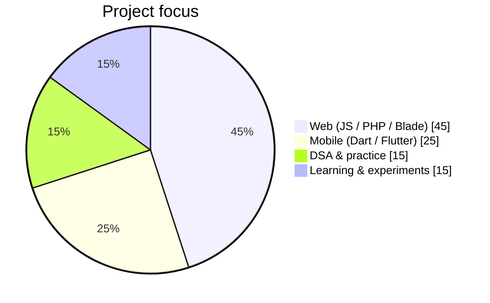
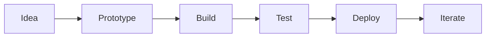

<!-- Art + Creativity + Multimedia -->
<pre align="center">
     ██╗██╗   ██╗███╗   ███╗██╗   ██╗██████╗ 
     ██║██║   ██║████╗ ████║╚██╗ ██╔╝██╔══██╗
     ██║██║   ██║██╔████╔██║ ╚████╔╝ ██████╔╝
██   ██║██║   ██║██║╚██╔╝██║  ╚██╔╝  ██╔══██╗
╚█████╔╝╚██████╔╝██║ ╚═╝ ██║   ██║   ██████╔╝
 ╚════╝  ╚═════╝ ╚═╝     ╚═╝   ╚═╝   ╚═════╝ 
</pre>

<p align="center">
  
</p>

<p align="center">
  
</p>

<h2 align="left">Hi there, I'm <a href="https://github.com/Juuwuwmyr">Juuwuwmyr</a> 👋</h2>

<!-- Short-and-sweet + Default -->
<p><strong>Developer</strong> building web apps, school systems, and mobile tools — inspired by the <a href="AWESOME-TEMPLATES-CATALOG.md">awesome profile README templates</a> in this repo.</p>

<p align="left">
  <a href="https://github.com/Juuwuwmyr"></a>
  <a href="https://jumyrmoreno.infinityfreeapp.com/"></a>
  
  
  
</p>

<!-- Dynamic Realtime: Simple Icons -->
<a href="https://github.com/Juuwuwmyr">
  
</a>
<a href="https://jumyrmoreno.infinityfreeapp.com/">
  
</a>

<br /><br />

<!-- Elaborate -->
### 🌱 About me

- 🔭 **Currently working on** [OSAS_WEB](https://github.com/Juuwuwmyr/OSAS_WEB), [E-CDN](https://github.com/Juuwuwmyr/E-CDN), and [E-UtangMate](https://github.com/Juuwuwmyr/E-UtangMate)
- 🌱 **Learning** Laravel/Blade, Flutter/Dart, and stronger DSA patterns ([Space-war-DSA](https://github.com/Juuwuwmyr/Space-war-DSA))
- 👯 **Open to collaborate** on school management, POS, and community web projects
- 💬 **Ask me about** JavaScript, PHP, HTML/CSS, and student-facing apps
- 📫 **Reach me** via [portfolio](https://jumyrmoreno.infinityfreeapp.com/) or [GitHub issues](https://github.com/Juuwuwmyr/Juuwuwmyr/issues)
- ⚡ **Fun fact:** This profile README mixes every template style from [art](art), [code-styled](code-styled), [creativity](creativity), [default](default), [dynamic-realtime](dynamic-realtime), [elaborate](elaborate), [flowcharts](flowcharts), [multimedia](multimedia), [pie-charts](pie-charts), [short-and-sweet](short-and-sweet), and [tabular](tabular).

<!-- Code-styled -->
### 💻 Me in code

```javascript
const jumyr = {
  pronouns: "He/Him",
  location: "Naujan, Oriental Mindoro, PH",
  code: ["JavaScript", "PHP", "Dart", "Python", "HTML", "Blade"],
  focus: ["Web apps", "Mobile (Flutter)", "School & finance tools"],
  currentlyBuilding: [
    "OSAS_WEB",
    "E-CDN",
    "EUT_WEB",
    "E-UtangMate",
    "RENOPHP",
  ],
  portfolio: "https://jumyrmoreno.infinityfreeapp.com/",
  funFact: "Profile powered by GitHub Actions + readme stats widgets",
};
```

<!-- Tabular -->
### 🛠 Languages & tools

| Using | |
| --- | --- |
| [](https://developer.mozilla.org/en-US/docs/Web/JavaScript) | [](https://nodejs.org/) | [](https://react.dev/) | [](https://www.php.net/) | [](https://dart.dev/) | [](https://www.python.org/) | [](https://git-scm.com/) |

| Learning | |
| --- | --- |
| [](https://laravel.com/) | [](https://flutter.dev/) | DSA & game logic |

<!-- Pie-charts + Flowcharts (Mermaid) -->
### 📊 How I spend dev time





<!-- Dynamic Realtime: GitHub Readme Stats -->
### 📈 GitHub stats

<p align="center">
  
  
</p>

<p align="center">
  
</p>

<!-- Profile Summary For GitHub -->
<p align="center">
  
</p>

<!-- lowlighter/metrics (see .github/workflows/metrics.yml) -->
### 📊 GitHub Metrics

<p align="center">
  
</p>

### ⭐ Pinned & featured repositories

| Repository | Stack | Notes |
| --- | --- | --- |
| [OSAS_WEB](https://github.com/Juuwuwmyr/OSAS_WEB) | JavaScript | Office of Student Affairs web system |
| [E-CDN](https://github.com/Juuwuwmyr/E-CDN) | JavaScript | [Live demo](https://colegio-de-naujan.vercel.app) |
| [EUT_WEB](https://github.com/Juuwuwmyr/EUT_WEB) | Blade / Laravel | E-Utang web companion |
| [E-UtangMate](https://github.com/Juuwuwmyr/E-UtangMate) | Dart | Mobile utang tracker |
| [RENOPHP](https://github.com/Juuwuwmyr/RENOPHP) | PHP | PHP project |
| [Space-war-DSA](https://github.com/Juuwuwmyr/Space-war-DSA) | — | DSA / game practice |

<p align="center">
  <a href="https://github.com/Juuwuwmyr/OSAS_WEB">
    
  </a>
  <a href="https://github.com/Juuwuwmyr/E-CDN">
    
  </a>
  <a href="https://github.com/Juuwuwmyr/E-UtangMate">
    
  </a>
  <a href="https://github.com/Juuwuwmyr/EUT_WEB">
    
  </a>
  <a href="https://github.com/Juuwuwmyr/RENOPHP">
    
  </a>
  <a href="https://github.com/Juuwuwmyr/Space-war-DSA">
    
  </a>
</p>

### 📂 All public repositories

| Project | Language | Link |
| --- | --- | --- |
| 20minutes_a_day_learning_new_language | — | [Repo](https://github.com/Juuwuwmyr/20minutes_a_day_learning_new_language) |
| 20minutes_a_day_learning_new_language-python | Python | [Repo](https://github.com/Juuwuwmyr/20minutes_a_day_learning_new_language-python) |
| 2_player_tetris | — | [Repo](https://github.com/Juuwuwmyr/2_player_tetris) |
| Batch--1--Moreno--Jumyr-M | — | [Repo](https://github.com/Juuwuwmyr/Batch--1--Moreno--Jumyr-M) |
| ClassroomFinanceTracker | HTML | [Repo](https://github.com/Juuwuwmyr/ClassroomFinanceTracker) |
| E-Attendance | — | [Repo](https://github.com/Juuwuwmyr/E-Attendance) |
| E-CDN | JavaScript | [Repo](https://github.com/Juuwuwmyr/E-CDN) |
| E-UtangMate | Dart | [Repo](https://github.com/Juuwuwmyr/E-UtangMate) |
| EUT_Delivery | — | [Repo](https://github.com/Juuwuwmyr/EUT_Delivery) |
| EUT_WEB | Blade | [Repo](https://github.com/Juuwuwmyr/EUT_WEB) |
| fluffy-invention- | — | [Repo](https://github.com/Juuwuwmyr/fluffy-invention-) |
| Jumyr | — | [Repo](https://github.com/Juuwuwmyr/Jumyr) |
| Juuwuwmyr | — | [Repo](https://github.com/Juuwuwmyr/Juuwuwmyr) |
| Maze_Game | — | [Repo](https://github.com/Juuwuwmyr/Maze_Game) |
| Myrepository | — | [Repo](https://github.com/Juuwuwmyr/Myrepository) |
| My_Portfolio | — | [Repo](https://github.com/Juuwuwmyr/My_Portfolio) |
| OSAS_WEB | JavaScript | [Repo](https://github.com/Juuwuwmyr/OSAS_WEB) |
| Point-of-Sale | — | [Repo](https://github.com/Juuwuwmyr/Point-of-Sale) |
| Projects | — | [Repo](https://github.com/Juuwuwmyr/Projects) |
| RENOPHP | PHP | [Repo](https://github.com/Juuwuwmyr/RENOPHP) |
| Space-war-DSA | — | [Repo](https://github.com/Juuwuwmyr/Space-war-DSA) |

<!-- Placeholder for github-activity-readme / profile-activity-generator -->
<!--START_SECTION:activity-->
<!--END_SECTION:activity-->

---

<p align="center">
  ⭐ From <a href="https://github.com/Juuwuwmyr">Juuwuwmyr</a> · Template gallery: <a href="AWESOME-TEMPLATES-CATALOG.md">AWESOME-TEMPLATES-CATALOG.md</a>
</p>
